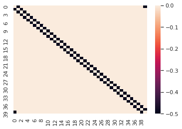
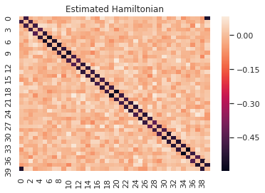
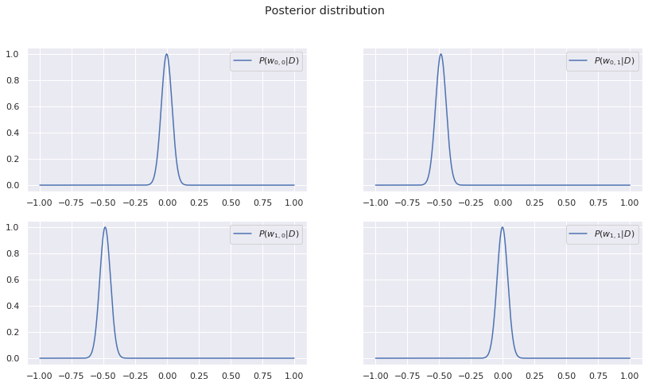
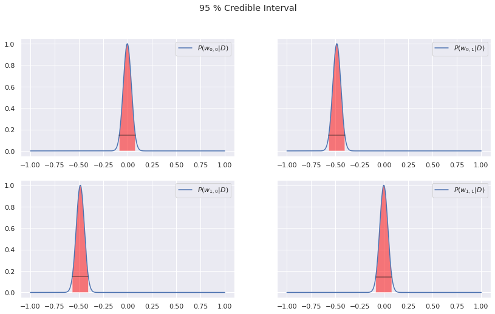

### About the project 

* Goal
    * I had experience with classical machine learning (ML)
    * Morten suggested the Bayesian approach
    * This project is a Bayesian version of a project others have done with classical ML


* I like deriving things from first principles
* That is what I have done here
* This might be long, but I was assured it was ok!

### Overview

1. General intro to Bayesian statistics
2. Bayesian regression (coded in NumPy)
3. Bayesian Convolutional Neural Network (coded in Tensorflow Probability)
4. Bonus: Bayesian inference from one-off events

### Resources

* Books
    * _Data Analysis - A Bayesian Tutorial_ by Devinderjit Sivia
    * _Machine Learning: A Probabilistic Perspective_ by Kevin P. Murphy

* Articles
    * Shridhar et al. _Uncertainty Estimations by Softplus normalization in Bayesian Convolutional Neural Networks with Variational Inference_ https://arxiv.org/pdf/1806.05978.pdf
    * Wen et al. _Flipout: Efficient pseudo independent weight perturbations on mini-batches_ https://arxiv.org/pdf/1803.04386.pdf
    * LeCun et al. _Gradient-Based Learning Applied to Document Recognition_ http://yann.lecun.com/exdb/publis/pdf/lecun-01a.pdf
    * Mehta et al. _A high-bias, low-variance introduction to Machine Learning for physisits_ https://arxiv.org/pdf/1803.08823.pdf, https://physics.bu.edu/~pankajm/MLnotebooks.html

# Part 1 - Bayesian Statistics

### What is Bayesian statistics?

* An alternative to the __classical/frequentist__ school of statistics
* Difference:
    * Bayesian: Views probability as our subjective uncertainty about the world
        * The parameters are the random/uncertain variables
    * Classical: nature is random, probability represents that randomness
        * The data are the random/uncertain variables
    * The Prior
        * The most notable feature of Bayesian statistics
        * Incorporates prior information about the problem
        * Using various priors are often equivalent to regularization schemes in classical ML
        * Will get back to exactly what the prior is
    

### Benefits of the Bayesian approach 
* Hypothesis estimate is a distribution (pdf) in parameter space
    * Not just a point estimate
    * Gives information about the robustnes of the estimate
    * By comparing MAP to other nearby points
    * Lets you define Credible Intervals (CI)
        * "What people think confidence intervals is" - Murphy
        * Confidence intervals are confusing, scientists often misunderstand it
        * Credible intervals makes total sense
    * Allows one to do probabilistic ML (part 3)
    
    
* Solutions to some pathologies that exist in classical statistics
    * E.g. inference from one-off events (part 4)
    
    
* More elegant
    * Various ML models are just special cases of the same idea
    * Feels more consistent/unified

### Bayes Theorem


$${p(A|B) = \frac{p(B|A)p(A)}{p(B)}}$$


* Everything is based on this equation
* Also used in classical statistics

### Derivation of Bayes theorem

* We have two parameters $A$ and $B$. 


* $p(A,B)$ denotes the probability that both of those values are the true values of A and B.


* $p(A|B)$ denotes the probability that A is true given that B is true


* We then start with 


$$p(A,B) = p(A|B)p(B)$$


* Intuition:
    * We evaluate each in order

* Then since $p(A,B) = p(B,A)$ it must follow that


$$p(A|B)p(B) = p(B|A)p(A)$$


* Which leads to Bayes theorem


$${p(A|B) = \frac{p(B|A)p(A)}{p(B)}}$$


* Usually written as 


$$\boxed{p(A|B)  \propto p(B|A)p(A)}$$
    
* With $p(B)$ is as a normalization constant 
    * Meaning $\int_A p(A'|B)dA' = 1$
    * The sum over all possibilities must be unity

### Bayesian Inference


* Inference using Bayes theorem


* We have a dataset $D = \{d_1, d_2, .., d_N\}$ 
    * Measurements of value $y$ that is a function of a parameter vector $\vec{x}$
    * I.e. $d_i = y(\vec{x}^i | \boldsymbol{\theta})$
    
    
* $D$ and $X=[\vec{x}^i]^T$ are known 


* We want to find the function $y$ 
    * Meaning we need to find its parameters $\boldsymbol{\theta}$ 


* (if the shape/form of $y$ is assumed) 


* Any parameter configuration $\boldsymbol{\theta}$ is a unique hypothesis 


* For any given $\boldsymbol{\theta}$, we want to know the probability of that hypothesis being true given the data, described as

$$
p(\boldsymbol{\theta}|D)
$$

* We can then use Bayes theorem to get


$$ 
\boxed{
p(\boldsymbol{\theta}|D)  \propto {p(D|\boldsymbol{\theta})p(\boldsymbol{\theta})}
}$$

* $p(D|\boldsymbol{\theta})$ is called the __likelihood function__ 
    * Probability of getting the data $D$ if $\boldsymbol{\theta}$ is true. 


* $p(\boldsymbol{\theta})$ is called the __prior distribution__  for the hypothesis, 
    * Probability distribution for various hypotheses $\boldsymbol{\theta}$ being true prior to seeing the data. 


* $p(\boldsymbol{\theta}|D)$ is known as the __posterior distribution__
    * Bayes theorem lets us create it from the prior and the likelihood
    * Describes the probability estimate for the given hypothesis


### Comparison to classical inference

* With classical statistical inference, one is only interested in the value for $\boldsymbol{\theta}$ that maximizes the probability of getting the obtained data, i.e.


$$
\hat{\boldsymbol{\theta}} = \underset{\boldsymbol{\theta}}{\text{argmax}} \ p(D|\boldsymbol{\theta})
$$


* $\hat{\boldsymbol{\theta}}$ is known as the MLE (maximum likelihood estimate).  


* Just a point estimate 

* No information about the robustness of the estimate

# Part 2 - Bayesian Regression on the 1D Ising model (with Noise)


* Bayesian regression is just one type of Bayesian inference


* I.e. it is Bayesian inference with just a specific likelihood and prior

### Generating data from the 1D Ising Model (with noise)

* We randomly generate a set of $N$ states $\{\vec{S}^i\}$ of the 1D ising model 
    * Meaning N 1D vectors consisting of -1s and 1s 
* Then calculate their energies $E_i = H[{\vec{S}^i}]$ using the following Hamiltonian:


$$
H[{\vec{S}^i}] = \sum_{j=1}^L\sum_{k=1}^L J_{jk}{S}_j^i{S}_{k}^i + \epsilon
$$

* ${S}_j^i$ is the j'th element of the i'th state $\vec{\vec{S}^i}$. 


* We choose nearest neighbour Hamiltonian with interaction -0.5, 
    * I.e. $J_{jk} =-0.5 \cdot \max \big(\delta_{j,k-1}, \delta_{j,k+1}\big)$.
    * In other words, each element only interacts with its neighbour.
    * All values of the matrix $J$ will be zero except for the elements on the two diagonal next to the main diagonal which will have value -0.5.


* The max energy is 40 so $\epsilon \sim \mathcal{N}(0,2.5)$ seems like a reasonable choice.


* We will then try to see if we can re-extract this Hamiltonian from the data using Bayesian Linear regression.


### Producing the data


```python
import numpy as np
import scipy.sparse as sp
np.random.seed(13)
import warnings
# Comment this to turn on warnings
warnings.filterwarnings('ignore')
### define Ising model aprams
L=40 # system size
# create 10000 random Ising states
states=np.random.choice([-1, 1], size=(1400,L))

def ising_energies(states_, plot_true=False):
    """
    This function calculates the energies of the states in the nn Ising Hamiltonian
    """
    L = states.shape[1]
    J = np.zeros((L, L),)
    for i in range(L): 
        J[i,(i+1)%L]=-0.5 # interaction between nearest-neighbors
        J[(i+1)%L,i]=-0.5
    # compute energies
    E = np.einsum('...i,ij,...j->...',states_,J,states_)
    
    if plot_true:
        import matplotlib.pyplot as plt
        %matplotlib inline
        import seaborn as sns

        sns.heatmap(J)
        #plt.title("Parameters of the True Hamiltonian")
        plt.show()
    return E
```

### Plotting the True Hamiltonian


```python
import seaborn as sns

# calculate Ising energies
energies=ising_energies(states,plot_true=True)

# Adding noise:
noise_variance = 2.5
energies += np.random.normal(0,scale=np.sqrt(noise_variance), size=energies.shape)
```





### Performing the regression
* The goal is to create the posterior from the likelihood and the prior using


$$ p(\boldsymbol{\theta}|D)  \propto {p(D|\boldsymbol{\theta})p(\boldsymbol{\theta})}.$$

* where $\boldsymbol{\theta} = \{W, \sigma^2\}$ is our hypothesis
    * $\sigma^2$ represents our estimation of $\epsilon$ 
    * $W$ is our estimation of $J$ 
    

* Meaning
$$
H_{model}[\vec{x}^i] = \sum_{j=1}^L\sum_{k=1}^L W_{jk}S_j^iS_{k}^i + \hat{\epsilon}
$$
where
$$
\hat{\epsilon} \sim \mathcal{N}(0,\sigma^2)
$$


* We thus need to specify the likelihood and the prior


* How this is done is of course problem dependent.


#### Remapping for easier calculation

* We remap the state vectors so it contains all combinations of interaction by taking the outer product and then making it 1 dimensional, i.e.

$$\vec{{x}}^i = \text{flatten } (\vec{S}^i\otimes \vec{S}^i)$$

* We also flatten $W$

$$
\vec{w} = \text{flatten } (W)
$$

* We can now write the predicted energy as a dot product for any given hypothesis $\vec{w}$

$$
\hat{E}_i = \vec{w}^T \vec{x}^i
$$

* or all the predicted energies as a vector

$$
\vec{\hat{E}} =  X\vec{w}
$$
where $X = [\vec{x}^i]^T$


* We will assume that $\sigma^2$ is known, since we could just measure it by holding $\vec{S}^i$ constant and measuring the energy multiple times
    * This means $\vec{w}$ represents our full hypothesis, i.e.
    $$
    p(\theta|D) = p(\vec{w}|D)
    $$


### Remapping: 


```python
new_states = np.einsum('bi,bo->bio',states,states)
new_states = new_states.reshape(new_states.shape[0],-1)
```

#### Choosing the Likelihood
* Common to make the assumption that the data is __iid__ (identically and independently distributed)
    * This is a correct assumption in our case.


* We denote the datapoint for the _measured_ energy as $d_i=E_i$
    * And the vector containing all the measurements as $\vec{y} = [d_i]$


* The likelihood is defined as 


$$
p(D|\boldsymbol{\theta}) = p(d_1|\boldsymbol{\theta})p(d_2|\boldsymbol{\theta},d_1)...p(d_N|\boldsymbol{\theta},d_{N-1}...,d_1)
$$

* It can then be simplified as 


$$
p(D|\boldsymbol{\theta}) = \prod_i^N p(d_i|\boldsymbol{\theta})
$$

* Because 

$$p(d_i | \boldsymbol{\theta}, d_j) = p(d_i | \boldsymbol{\theta})$$ 
    
* We then insert

$$
\begin{align}
p(d_i|\boldsymbol{\theta}) & = \mathcal{N}(\vec{w}^T\vec{x}^i, \sigma^2) \\ 
                           & \propto \exp \Big[-\dfrac{1}{2\sigma^2} (d_i-\vec{w}^T\vec{x}^i)^2\Big]
\end{align}
$$

* The term $\vec{w}^T \vec{x}^i$ is why it is regression, as it is a linear mapping of the input
   

* The Gaussian is commonly used because this is the probability distribution with the highest entropy for iids. 
    * In other words, if the data is iid, the Gaussian is the _most probable way for the data to be distributed_. 
    * Here we assume that the noise variation $\sigma^2$ does not change with $\vec{x}$ (which is not always a correct assumption).
    

* We insert the expression for $p(d_i|\boldsymbol{\theta})$ into the expression for the likelihood


* The full likelihood is then

$$
\begin{align}
p(D|\boldsymbol{\theta}) & =  \prod_i^N \mathcal{N}(\vec{w}^T\vec{x}^i, \sigma^2) \\
&\propto \exp \Big[-\sum_i^N \dfrac{1}{\sigma^2} (d_i-\vec{w}^T\vec{x}^i)^2\Big]\\
& = \exp \Big[ - \dfrac{1}{2\sigma^2}(\vec{y}-X\vec{w})^T(\vec{y}-X\vec{w}) \Big].
\end{align}
$$


#### Choosing the Prior
* We need to decide a shape for our prior 

$$
p(\boldsymbol{\theta}) = p(\vec{w}).
$$

* A common choice is the zero mean multivariate Gaussian. 
    * This gives a higher prior probaility to functions with small, even parameters, i.e. smoother / less complex functions. 
    * This in a way captures the idea of Occam's Razor that we should prefer the simplest hypothesis that explains the data (although other zero zentered, symmetric distributions with tails that go to zero would capture this this as well).
    * It also makes it easier mathematically when the likelihood is Gaussian as well (called conjugate prior). 


* Therefore

$$
\begin{align}
p(\vec{w}) &= \mathcal{N}(\vec{w} | \vec{w}_0, V_0)\\
& \propto \exp \Big[ - \frac{1}{2}(\vec{w}- \vec{w}_0)^T V_0^{-1} (\vec{w}- \vec{w}_0) \Big].
\end{align}
$$

* $\vec{w}_0$ is the mode of the prior


* $V_0$ is the precision matrix of the prior
    * Inverse of the covariance matrix
    * Meaning it reflecs how we assume the elements of $\vec{w}$ are correlated

#### Calculating the Posterior
* Now that we have the likelihood and prior, we can find the posterior as


$$
\begin{align}
p(\vec{w}|D) & \propto {p(D|\vec{w})p(\vec{w})} \\
             & \propto \exp \Big[  -\dfrac{1}{2\sigma^2}(\vec{y}-X\vec{w})^T(\vec{y}-X\vec{w}) - \frac{1}{2}(\vec{w}- \vec{w}_0)^T V_0^{-1} (\vec{w}- \vec{w}_0) \Big]
\end{align}
$$

* By doing some algebra this can be rewritten as a multivariate Gaussian with mean $\vec{w}_N$ and precision matrix $V_N$


$$
\boxed{
\begin{align}
p(\vec{w}|D) = \mathcal{N}(\vec{w}|\vec{w}_N, V_N)
\end{align}},
$$

* Where

$$
\boxed{
\begin{align}
\vec{w}_N &= V_N V_0^{-1} + \frac{1}{\sigma^2}V_N X^T \vec{y}, \\
V_N^{-1}  &= V_0^{-1} + \frac{1}{\sigma^2}X^TX,\\
V_N       &= \sigma^2(\sigma^2V_0^{-1} + X^T X)^{-1} 
\end{align}}.
$$


### The Special Case when $\vec{w}_0=\vec{0}$ and $V_0 = \tau^2I$
* The prior is then
$$
\begin{align}
p(\vec{w}) &= \prod_j^M \mathcal{N}(w_j | 0, \tau^2)\\
& \propto \exp \Big[- \frac{1}{2\tau^2}\sum_j^M {w_j^2} \Big]
\end{align}
$$
* Where $1/\tau^2$ controls the strength of the prior.

* We now have

$$
\begin{align}
p(\vec{w}|D) & \propto {p(D|\vec{w})p(\vec{w})} \\
                         & \propto \exp \Big[- \Big( \sum_i^N \dfrac{1}{\sigma^2} (d_i-\vec{w}^T\vec{x}^i)^2 +\sum_j^M w_j^2 / \tau^2\Big) \Big]
\end{align}
$$


* The MAP estimate is the value of $\vec{w}$ that maximizes $p(\vec{w}|D)$, which means the value that minimizes the exponent, i.e.

$$
\begin{align}
\vec{w}_\text{MAP} & = \underset{\vec{w}}{\text{argmin}} \sum_i^N \dfrac{1}{\sigma^2} (d_i-\vec{w}^T\vec{x}^i)^2 +\sum_j^M w_j^2 / \tau^2 \\
\end{align}
$$

* We can see that this is equivalent to regular regression with L2 regularization.


* This has an analytical solution, which we can find by rewriting to matrix formulation

$$
\vec{w}_\text{MAP} = \underset{\vec{w}}{\text{argmin}} \ (\vec{y}-X\vec{w})^T(\vec{y}-X\vec{w}) + \lambda \vec{w}^T\vec{w}
$$

* Where $\vec{y}$ is the vector containing the data $D$. 


* We can then differentiate the right side with respect to $\vec{w}$ and set equal to zero to find the solution as

$$
\boxed{\vec{w}_\text{MAP} = (\lambda I_M + {X}^T{X})^{-1}{X}^T\vec{y}}
$$

* This is equivalent to ridge regression in classical statistics.


* Since we are working with Gaussians, $\vec{w}_\text{MAP} = \vec{w}_N$

### Coding Bayesian regression with NumPy

* Reminder: $\sigma^2$ is assumed to be known. 


* We also have no prior reason to believe that the elements in $\vec{w}$ are correlated


* Nor have we any prior reason to know whether they are positive or negative


* This means the special case of $\vec{w}_0=\vec{0}$ and $V_0 = \tau^2 I$ applies here.


```python
n = new_states.shape[0]   # number of data
D = new_states.shape[1]   # data dimension

# Prior:
variance = 2.5
w0 = np.zeros(D)
tau = 1 # 1 means unitary gaussian, determines the strength of the prior
V0 = tau**2*np.identity(D)  # precision matrix of prior
V0_inv = np.linalg.inv(V0)

mean_x = np.mean(new_states,axis=0,keepdims=True)

X = new_states #- mean_x # data matrix with data as rows, centered

y = energies - np.mean(energies)

VN_inv = V0_inv + np.dot(X.T,X) / variance
VN = np.linalg.inv(VN_inv)

wN = np.dot(np.dot(VN,V0_inv),w0) + np.dot(np.dot(VN,X.T),y) / variance

```

### Plotting $\vec{w}_{MAP}$ 
* Need to make it back into a matrix first


```python
import matplotlib.pyplot as plt
%matplotlib inline
import seaborn as sns
sns.set()
sns.heatmap(wN.reshape(L,L))
plt.title("Estimated Hamiltonian")
plt.show()
```





### The Posterior Distribution

* We now have the full posterior $P(\vec{w}|D)$


* We can see how the probability changes as we move in parameter space away from the MAP estimate
    * i.e. how confident we would be in points near $\vec{w}_{MAP}$ 
    
    
* We only show the posterior for four of the parameters.


```python
import matplotlib.pyplot as plt
dw = 0.001
w_range = np.arange(-1.,1., dw)

#print(w_range)
def Pw(index1,index2):
    
    index = index1*L + index2
    vec = wN.copy()
    
    logs = np.zeros(len(w_range))
    for k in range(len(w_range)):
        w = w_range[k]
        vec[index] = w
        logs[k] = -0.5 * np.dot(np.dot((vec - wN).T, VN_inv),vec - wN)
    
    logs -= np.max(logs)
    P = np.exp(logs)
    return P 

def plot_w_distribution(ax, index1,index2,show=False):
    P = Pw(index1,index2)
    ax.plot(w_range,P, label="$P(w_{%.i,%.i}|D)$" % (index1,index2))
    ax.legend()
    if show:
        plt.show()

```


```python
import seaborn as sns
sns.set
fig, axes = plt.subplots(2,2,sharex=False, sharey=True)
fig.set_size_inches(18.5*0.75, 10.5*0.7)
plot_w_distribution(axes[0,0], 0,0,show=False)
plot_w_distribution(axes[0,1],0,1,show=False)
plot_w_distribution(axes[1,0],1,0,show=False)
plot_w_distribution(axes[1,1],1,1,show=False)
fig.suptitle("Posterior distribution")
plt.show()
```





### Credible Intervals

* We will show the 95 % HDI (Highest Density Interval) 
    * Means the region that contains 95 % of the probability mass 
    * Where all points in the region are higher than the ones outside. 
    * So the probability that the true value is inside the HDI is 95%
        * _Given_ that all assumptions made are true
        

* This area is not necessarily contiguous if the PDF is multimodal


* But since the posterior here is gaussian, it is monomodal and the HDI is the same as the Central Interval.


* Algorithm used to find the HDI region: 
    * Turning the curve upside down and filling it with water drop by drop


```python
def credible_interval(ax, index1, index2):
    P_ = Pw(index1,index2)
    # normalize
    P_normed = P_ / np.sum(P_)
    
    ############################
    # Water filling algorithm: #
    ############################
    #points = np.zeros_like(P_normed, dtype=np.int)
    points_taken= []
    points = []
    done = False
    t = 0
    while not done:
        best=0
        bestindex=0
        for i in range(len(P_normed)-1):
            if i not in points_taken:
                val = P_normed[i]
                if val > best:
                    best = val
                    bestindex = i
        points_taken.append(bestindex)
        points.append(best)
        if np.sum(points) >= 0.95:
            done=True
    
    points_taken = np.array(points_taken, dtype=np.int)
    argsorted = np.argsort(points_taken)

    points_taken = points_taken[argsorted]
    
    
    plot_w_distribution(ax, index1,index2,show=False)
    first_lastw = [w_range[points_taken[0]], w_range[points_taken[-1]]]
    first_lastP = [P_[points_taken[0]], P_[points_taken[-1]]]

    
    fill = np.zeros(len(points_taken)+2)
    fill[1:-1] = P_[points_taken]
    
    w_range_fill = np.zeros_like(fill)
    w_range_fill[1:-1] = w_range[points_taken]
    w_range_fill[0] = w_range_fill[1]
    w_range_fill[-1] = w_range_fill[-2]
    
    ax.fill(w_range_fill,fill,facecolor="red",alpha=0.5)
    
    line = [P_[points_taken[0]],P_[points_taken[-1]]] 
    line = np.ones(2)*P_[points_taken[0]] # looks better, but not actually totally correct
    ax.plot(first_lastw,line, "k", alpha=0.5)

```


```python
sns.set()
fig, axes = plt.subplots(2,2,sharex=False, sharey=True)
fig.set_size_inches(18.5*0.75, 10.5*0.75)
credible_interval(axes[0,0], 0,0); credible_interval(axes[0,1],0,1)
credible_interval(axes[1,0],1,0); credible_interval(axes[1,1],1,1)
plt.suptitle("95 % Credible Interval")
plt.show()
```





### Test data

* We can evaluate the performance by calculationg the __coefficient of determination__, given by


$$
\begin{align}
R^2 &=  \big(1-\frac{u}{v}\big),\\
u &= \big(y_{\text{predicted}} - y_{\text{true}}\big)^2 \\
v &= \big(y_{\text{predicted}} - \langle y_{\text{true}}\rangle\big)^2
\end{align}
$$


* The best possible score is then $R^2=1$, but it can also be negative. 


* A model that always only predicts the expected value of $y$, $ \langle y_{\text{true}}\rangle$, disregarding the input features, would get a $R^2$ score of 0 [4].


```python
test_states=np.random.choice([-1, 1], size=(1000,L))
# calculate Ising test energies
test_energies=ising_energies(test_states)

# remapping states:
test_states = np.einsum('bi,bo->bio',test_states,test_states)
test_states = test_states.reshape(test_states.shape[0],-1)

predicted_energies = np.dot(test_states, wN)


### R^2 - coefficient of determination
y_true_avg = np.mean(test_energies)
residuals = predicted_energies - test_energies
u = np.dot(residuals,residuals)
v = test_energies - y_true_avg
v = np.dot(v,v)

R_squared = 1 - u/v

print(R_squared)

```

    0.9267901659624258


# Part 3 - Bayesian Neural Networks on 2D Ising Data

### The 2D Ising model

* Model of a ferromagnet (or also other things)


* Undergoes a phase transition around a critical temperature $T_c$
    * Goes from disordered to the ordered state
    * There is a transitional stage in between
   
   
* Idea:
    * Train a classifier on states that we know are definitely ordered or disordered
    * Then use the classifier on states from the transition state / critical region


Source: Mehta et al. [4] 

### General Neural Networks
* A general neural network is a function that transfers an input vector $\vec{x}$ to an output vector $\hat{y}=\mathcal{F}(\vec{x})$
    * $\vec{y}$ usually represents a prediction for a set of classes to cathegorize $\vec{x}$ as 


* Generally a neural net with $L$ layers is on the form

$$
    \mathcal{F}(\vec{x}) = g_L(\boldsymbol{W}^L \ g_{L-1}(\boldsymbol{W}^{L-1} \dots g_1(\boldsymbol{W}^1\vec{x}) \dots))
$$
* The matrices $\boldsymbol{W}^l$ can be tuned/trained such that $\mathcal{F}$ maps the way we want 
    * They represent the hypothesis 
    * The parameters of the model
    * Called weights
    

* $g_l: \mathbb{R}^k \rightarrow \mathbb{R}^k$ are activation functions that adds non-linearities that are needed


* For any arbitrary architecture we denote the total number of parameters in such a network by $N$.

### The Essence of a Bayesian Convolutional Neural Network

* In a Bayesian Neural Network with the same architecture, the number of parameters is instead $2N$. 


* Each weight $w_{ij}$ in $W$ is instead represented as a distribution
    * Each weight is switched out with two parameters $\mu_{ij}$ and $\sigma_{ij}$
    * The hypothesis / trainable parameters are now $\theta = \{ \mu_{ij}, \sigma_{ij}^2 \}$
    * Represents the mean and standard deviation in a normal distribution
    * I.e. distribution of weights instead of point estimate


* When we do a forward pass and need the weights, we just sample them from this distribution, i.e.

$$
w_{ij} \sim \mathcal{N}(\mu_{ij}, \sigma_{ij}^2),
$$

* We do this for all $i$ and $j$ 
    * Then insert into $\mathcal{F}$


* The posterior is in other words useful for sampling too!
    * This is probabilistic ML
    * Only 2N parameters for in principle an infinite ensemble of networks!

### Illustration of the difference between a frequentist and a Bayesian CNN. 


Source: Shridhar et al. [1].

###### This cell is skipped, but I am keeping the notes here
Can do inference 
$$
p(y|x,D) = \int p(y|x,\theta)p(\theta|D)d\theta.
$$

This can be understood as checking how much we believe datapoint $x^i$ belongs to class $y^i$ for all possible hypothesises $\theta$ while weighing for how much we believe in each $\theta$, based on the data. $D = \{d_i\}$ are the class labels for $X=\{x_i\}$.

### The Math 
* As before we want to find the posterior distribution over the weights
$$
p(w|D) = \frac{p(D|w)p(w)}{p(D)}
$$


* $D$ represents the labels for all the input data (we have skipped the conditioning on $X$)


* Let our Bayesian Neural Network model $q_\theta$ be a multivariate Gaussian approximation to the true posterior $p$.

$$
q_\theta(w|D) \approx p(w|D)
$$

* We then minimize the Kullback-Leibler (KL) divergence between the two distributions


$$
\theta_{opt} = \underset{\theta}{\text{argmin}} \ \text{KL} \ \big[q_\theta(w|D)||p(w|D)\big].
$$

* The KL divergence is a measure of how close two distributions are to each other, and is defined as

$$
\text{KL} \ \big[q_\theta(w|D)||p(w|D)\big] = \int q_\theta(w|D) \log \frac{q_\theta(w|D)}{p(w|D)}dw.
$$

* This can also be seen as the expectation value of $\log \dfrac{q_\theta(w|D)}{p(w|D)}$ with respect to $q_\theta(w|D)$      


* Meaning
$$
\text{KL} \ \big[q_\theta(w|D)||p(w|D)\big] = \mathbb{E}_{q_\theta(w|D)}\big[\log \frac{q_\theta(w|D)}{p(w|D)}\big].
$$


* The right side can be approximated as a discrete sum by sampling $w^i$ from $q_\theta(w|D)$


$$
\mathbb{E}_{q_\theta(w|D)}\big[\log \frac{q_\theta(w|D)}{p(w|D)}\big] \approx \frac{1}{m}\sum_i^m \log \frac{q_\theta(w^i|D)}{p(w^{i}|D)}.
$$


* We then substitute 

$$p(w^i|D) = \dfrac{p(D|w^i)p(w^i)}{p(D)}$$ 


* and use the rule for the logarithm of fractions, i.e. $\log \frac{a}{b} = \log a - \log b$


$$
\mathbb{E}_{q_\theta(w|D)}\big[\log \frac{q_\theta(w|D)}{p(w|D)}\big] \approx \frac{1}{m}\sum_i^m \log {q_\theta(w^i|D)} - \log p(w^i) - \log p(D|w^i)   + \log p(D)
$$


$$
\frac{1}{m}\sum_i^m \log {q_\theta(w^i|D)} - \log p(w^i) - \log p(D|w^i)   + \log p(D)
$$


* For each $w^i$ that we sample we can calculate all the terms
    * $\log {q_\theta(w^i|D)}$ is the current approximation
    * $\log p(w^i)$ is the prior 
    * $\log p(D|w^i)=p(D|w^i,X)$ is the predictions for all the input data $X$ 
    * The term $\log p(D)$ is just a constant, so we can remove that. 
    
    
* We then average over all the samples

* We thus have a tractable objective function that can be minimized with respect to $\theta = (\mu, \sigma^2)$


* By variational methods, Monte Carlo, evolutionary algorithms etc. 


* The optimum can now be found as

\begin{equation}
\boxed{
\begin{align}
\theta_{opt} & = \underset{\theta}{\text{argmin}} \frac{1}{m}\sum_i^m \log {q_\theta(w^i|D)} - \log p(w^i) - \log p(D|w^i) \\
& = \underset{\theta}{\text{argmin}} \ \text{KL} \ \big[q_\theta(w|D)||p(w)\big] - \mathbb{E}_{q_\theta(w|D)}\big[\log p(D|w^i)\big]
\end{align}
}
\end{equation}


This is also known as the __evidence lower bound__ (ELBO).

### Implementing a Bayesian Neural Net
* The following code trains a Bayesian Neural Network to classify states of the 2 dimensional Ising model by minimizing the ELBO
    * Architecture is LeNet-5 [3]
    * Using a minimizing scheme called Flipout [1].
        * Perturbs the parameters $\mu$ and $\sigma^2$ consecutively
        * Then finds the gradient and backpropagates


* It is written using TensorFlow Probability, 
    * TensorFlow for probabilistic ML. 
  
  
* The script is built on the code at the following Github repository https://github.com/tensorflow/probability/blob/master/tensorflow_probability/examples/bayesian_neural_network.py, modified for using the Ising model data.


```python
"""Trains a Bayesian neural network to classify data from the 2D Ising model.
The architecture is LeNet-5 [1].
#### References
[1]: Yann LeCun, Leon Bottou, Yoshua Bengio, and Patrick Haffner.
     Gradient-based learning applied to document recognition.
     _Proceedings of the IEEE_, 1998.
     http://yann.lecun.com/exdb/publis/pdf/lecun-01a.pdf
"""

from __future__ import absolute_import
from __future__ import division
from __future__ import print_function

import os
import warnings

# Dependency imports
from absl import flags
import matplotlib
matplotlib.use("Agg")
from matplotlib import figure  # pylint: disable=g-import-not-at-top
from matplotlib.backends import backend_agg
import numpy as np
import tensorflow as tf
import tensorflow_probability as tfp
import matplotlib.pyplot as plt
%matplotlib inline

from tensorflow.contrib.learn.python.learn.datasets import mnist


# TODO(b/78137893): Integration tests currently fail with seaborn imports.
warnings.simplefilter(action="ignore")

try:
    import seaborn as sns  # pylint: disable=g-import-not-at-top
    HAS_SEABORN = True
except ImportError:
    HAS_SEABORN = False

tfd = tfp.distributions

ISING = True

IMAGE_SHAPE = [40,40,1] if ISING else [28, 28, 1] 

flags.DEFINE_float("learning_rate",
                   default=0.001,
                   help="Initial learning rate.")
flags.DEFINE_integer("max_steps",
                     default=6000,
                     help="Number of training steps to run.")
flags.DEFINE_integer("batch_size",
                     default=128,
                     help="Batch size.")
flags.DEFINE_string("data_dir",
                    default=os.path.join(os.getenv("TEST_TMPDIR", "/tmp"),
                                         "bayesian_neural_network/data"),
                    help="Directory where data is stored (if using real data).")
flags.DEFINE_string(
    "model_dir",
    default=os.path.join(os.getenv("TEST_TMPDIR", "/tmp"),
                         "bayesian_neural_network/"),
    help="Directory to put the model's fit.")
flags.DEFINE_integer("viz_steps",
                     default=400,
                     help="Frequency at which save visualizations.")
flags.DEFINE_integer("num_monte_carlo",
                     default=50,
                     help="Network draws to compute predictive probabilities.")
flags.DEFINE_bool("fake_data",
                  default=None,
                  help="If true, uses fake data. Defaults to real data.")

FLAGS = flags.FLAGS

def plot_weight_posteriors(names, qm_vals, qs_vals, fname):
    """Save a PNG plot with histograms of weight means and stddevs.
    Args:
    names: A Python `iterable` of `str` variable names.
    qm_vals: A Python `iterable`, the same length as `names`,
        whose elements are Numpy `array`s, of any shape, containing
        posterior means of weight varibles.
    qs_vals: A Python `iterable`, the same length as `names`,
        whose elements are Numpy `array`s, of any shape, containing
        posterior standard deviations of weight varibles.
    fname: Python `str` filename to save the plot to.
    """
    fig = figure.Figure(figsize=(6, 3))
    canvas = backend_agg.FigureCanvasAgg(fig)

    ax = fig.add_subplot(1, 2, 1)
    for n, qm in zip(names, qm_vals):
        sns.distplot(qm.flatten(), ax=ax, label=n)
    ax.set_title("weight means")
    ax.set_xlim([-1.5, 1.5])
    ax.legend()

    ax = fig.add_subplot(1, 2, 2)
    for n, qs in zip(names, qs_vals):
        sns.distplot(qs.flatten(), ax=ax)
    ax.set_title("weight stddevs")
    ax.set_xlim([0, 1.])

    fig.tight_layout()
    
    canvas.print_figure(fname, format="png")
    print("saved {}".format(fname))


def plot_heldout_prediction(input_vals, label_vals, probs,
                            fname, n=10, title=""):
    """Save a PNG plot visualizing posterior uncertainty on heldout data.
    Args:
    input_vals: A `float`-like Numpy `array` of shape
        `[num_heldout] + IMAGE_SHAPE`, containing heldout input images.
    probs: A `float`-like Numpy array of shape `[num_monte_carlo,
        num_heldout, num_classes]` containing Monte Carlo samples of
        class probabilities for each heldout sample.
    fname: Python `str` filename to save the plot to.
    n: Python `int` number of datapoints to vizualize.
    title: Python `str` title for the plot.
    """
    fig = figure.Figure(figsize=(9, 3*n))
    canvas = backend_agg.FigureCanvasAgg(fig)
    indices = np.random.randint(low=0,high=input_vals.shape[0],size=n)
    for i in range(n):
        ax = fig.add_subplot(n, 3, 3*i + 1)
        ax.imshow(input_vals[indices[i], :].reshape(IMAGE_SHAPE[:-1]), interpolation="None")

        ax = fig.add_subplot(n, 3, 3*i + 2)
        for prob_sample in probs:
            sns.barplot(np.arange(2) if ISING else np.arange(10), prob_sample[indices[i], :], alpha=1/FLAGS.num_monte_carlo, ax=ax)
            ax.set_ylim([0, 1])
        ax.set_title("posterior samples")

        ax = fig.add_subplot(n, 3, 3*i + 3)
        sns.barplot(np.arange(2) if ISING else np.arange(10), np.mean(probs[:, indices[i], :], axis=0), ax=ax)
        ax.set_ylim([0, 1])
        ax.set_title("predictive probs, correct=%.i" % label_vals[indices[i]] )
        
    fig.suptitle(title)
    fig.tight_layout()

    canvas.print_figure(fname, format="png")
    print("saved {}".format(fname))


def plot_test_prediction(input_vals, probs,
                            fname, n=10, title=""):
    """Save a PNG plot visualizing posterior uncertainty on heldout data.
    Args:
    input_vals: A `float`-like Numpy `array` of shape
        `[num_heldout] + IMAGE_SHAPE`, containing heldout input images.
    probs: A `float`-like Numpy array of shape `[num_monte_carlo,
        num_heldout, num_classes]` containing Monte Carlo samples of
        class probabilities for each heldout sample.
    fname: Python `str` filename to save the plot to.
    n: Python `int` number of datapoints to vizualize.
    title: Python `str` title for the plot.
    """
    fig = figure.Figure(figsize=(9, 3*n))
    canvas = backend_agg.FigureCanvasAgg(fig)
    indices = np.random.randint(low=0,high=input_vals.shape[0],size=n)
    for i in range(n):
        ax = fig.add_subplot(n, 3, 3*i + 1)
        ax.imshow(input_vals[indices[i], :].reshape(IMAGE_SHAPE[:-1]), interpolation="None")

        ax = fig.add_subplot(n, 3, 3*i + 2)
        for prob_sample in probs:
            sns.barplot(np.arange(2) if ISING else np.arange(10), prob_sample[indices[i], :], alpha=1/FLAGS.num_monte_carlo, ax=ax)
            ax.set_ylim([0, 1])
        ax.set_title("posterior samples")

        ax = fig.add_subplot(n, 3, 3*i + 3)
        sns.barplot(np.arange(2) if ISING else np.arange(10), np.mean(probs[:, indices[i], :], axis=0), ax=ax)
        ax.set_ylim([0, 1])
        ax.set_title("predictive probs, test set")
        
    fig.suptitle(title)
    fig.tight_layout()

    canvas.print_figure(fname, format="png")
    print("saved {}".format(fname))

def build_input_pipeline(mnist_data, batch_size, heldout_size):
    """Build an Iterator switching between train and heldout data."""

    # Build an iterator over training batches.
    training_dataset = tf.data.Dataset.from_tensor_slices(
        (mnist_data.train.images, np.int32(mnist_data.train.labels)))

    print(mnist_data.train.images.shape)
    training_batches = training_dataset.shuffle(
        50000, reshuffle_each_iteration=True).repeat().batch(batch_size)
    training_iterator = tf.compat.v1.data.make_one_shot_iterator(training_batches)

    # Build a iterator over the heldout set with batch_size=heldout_size,
    # i.e., return the entire heldout set as a constant.
    heldout_dataset = tf.data.Dataset.from_tensor_slices(
        (mnist_data.validation.images,
        np.int32(mnist_data.validation.labels)))
    heldout_frozen = (heldout_dataset.take(heldout_size).
                    repeat().batch(heldout_size))
    heldout_iterator = tf.compat.v1.data.make_one_shot_iterator(heldout_frozen)


    test_dataset = tf.data.Dataset.from_tensor_slices(
        (mnist_data.test.images,
        np.int32(mnist_data.test.labels)))
    test_frozen = (test_dataset.take(heldout_size).
                    repeat().batch(heldout_size))
    test_iterator = tf.compat.v1.data.make_one_shot_iterator(test_frozen)


    # Combine these into a feedable iterator that can switch between training
    # and validation inputs.
    handle = tf.compat.v1.placeholder(tf.string, shape=[])
    feedable_iterator = tf.compat.v1.data.Iterator.from_string_handle(
        handle, training_batches.output_types, training_batches.output_shapes)
    images, labels = feedable_iterator.get_next()

    return images, labels, handle, training_iterator, heldout_iterator, test_iterator


def test_data_pipeline(mnist_data, batch_size):
    """Build an Iterator switching between train and heldout data."""


    # Build a iterator over the heldout set with batch_size=heldout_size,
    # i.e., return the entire heldout set as a constant.
    heldout_dataset = tf.data.Dataset.from_tensor_slices(
        (mnist_data.test.images))
    heldout_frozen = (heldout_dataset.take(batch_size).
                    repeat().batch(batch_size))
    test_iterator = tf.compat.v1.data.make_one_shot_iterator(heldout_frozen)

    # Combine these into a feedable iterator that can switch between training
    # and test inputs.
    handle = tf.compat.v1.placeholder(tf.string, shape=[])
    feedable_iterator = tf.compat.v1.data.Iterator.from_string_handle(
        handle, heldout_dataset.output_types, heldout_dataset.output_shapes)
    images = feedable_iterator.get_next()

    return images, handle, test_iterator


def Get_ising_data():
    import pickle
    
    
    def read_t(t,root="/home/samknu/MyRepos/Bayesian-Machine-Learning/data/IsingData/"):
        data = pickle.load(open(root+'Ising2DFM_reSample_L40_T=%.2f.pkl'%t,'rb'))
        return np.unpackbits(data).astype(int).reshape(-1,1600)
    
    temperatures = np.arange(0.25, 4., step=0.25)
    
    ordered = np.zeros(shape=(np.sum(temperatures<2.0),10000,1600))
    disordered = np.zeros(shape=(np.sum(temperatures>2.5),10000,1600))
    critical = np.zeros(shape=(np.sum((temperatures>=2.0)*(temperatures<=2.5)),10000,1600))
    
    ordered_index = 0
    disordered_index = 0
    crit_index = 0
    for i in range(len(temperatures)):
        T = temperatures[i]
        if T < 2.0:
            ordered[ordered_index] = read_t(T)
            ordered_index += 1
        elif T > 2.5:
            disordered[disordered_index] = read_t(T)
            disordered_index += 1
        else:
            critical[crit_index] = read_t(T)
            crit_index += 1

    ordered = ordered.reshape(-1,1600)       # 70000
    disordered = disordered.reshape(-1,1600) # 50000
    critical = critical.reshape(-1,1600)     # 30000

    # Shuffling before separating into training, validation and test set
    np.random.shuffle(ordered)
    np.random.shuffle(disordered)
    np.random.shuffle(critical)

    training_data = np.zeros((6000*12,1600))
    validation_data = np.zeros((2000*12,1600))
    test_data = np.zeros((2000*12 + 10000*3,1600))

    training_data[:round(0.6*70000)] = ordered[:round(0.6*70000)]
    training_data[round(0.6*70000):] = disordered[:round(0.6*50000)]

    validation_data[:round(0.2*70000)] = ordered[round(0.6*70000):round(0.6*70000)+round(0.2*70000)]
    validation_data[round(0.2*70000):] = disordered[round(0.6*50000):round(0.6*50000)+round(0.2*50000)]

    test_data[:round(0.2*70000)] = ordered[round(0.6*70000)+round(0.2*70000):round(0.6*70000)+2*round(0.2*70000)]
    test_data[round(0.2*70000):round(0.2*70000)+round(0.2*50000)] = disordered[round(0.6*50000)+round(0.2*50000):round(0.6*50000)+2*round(0.2*50000)]
    test_data[round(0.2*70000)+round(0.2*50000):] = critical

    training_labels = np.zeros(6000*12)
    training_labels[round(0.6*70000):] = np.ones(round(0.6*50000))

    validation_labels = np.zeros(2000*12)
    validation_labels[round(0.2*70000):] = np.ones(round(0.2*50000))

    # Class 0 is ordered, class 1 is disordered

    ############################################################
    # Reshaping since we want them as matrices for convolution #
    ############################################################
    training_data = training_data.reshape(-1,40,40)
    training_data = training_data[:,:,:,np.newaxis]

    validation_data = validation_data.reshape(-1,40,40)
    validation_data = validation_data[:,:,:,np.newaxis]
    
    test_data = test_data.reshape(-1,40,40)
    test_data = test_data[:,:,:,np.newaxis]
    

    del ordered
    del disordered
    del critical
    del temperatures

    
    #############################
    # Shuffling data and labels #
    #############################
    indices = np.random.permutation(np.arange(training_data.shape[0]))
    training_data = training_data[indices]
    training_labels = training_labels[indices]
    
    indices = np.random.permutation(np.arange(validation_data.shape[0]))
    validation_data = validation_data[indices]
    validation_labels = validation_labels[indices]
    
    indices = np.random.permutation(np.arange(test_data.shape[0]))
    test_data = test_data[indices]
    #test_labels = test_labels[indices]
    
    cut_train = 20000   
    cut_val = 5000
    cut_test = 1000
    training_data = training_data[:cut_train]
    training_labels = training_labels[:cut_train]

    validation_data = validation_data[:cut_val]
    validation_labels = validation_labels[:cut_val]
    
    test_data = test_data[:cut_test]

    class Dummy(object):
        pass
    ising_data = Dummy()
    ising_data.train=Dummy()
    ising_data.train.images = training_data
    ising_data.train.labels = training_labels
    ising_data.train.num_examples = training_data.shape[0]

    ising_data.validation=Dummy()
    ising_data.validation.images = validation_data
    ising_data.validation.labels = validation_labels
    ising_data.validation.num_examples = validation_data.shape[0]


    ising_data.test=Dummy()
    ising_data.test.images = test_data
    ising_data.test.labels = np.zeros(test_data.shape[0])   # dummy labels
    ising_data.test.num_examples = test_data.shape[0]

    return ising_data


def main(argv):
    del argv  # unused

    if tf.io.gfile.exists(FLAGS.model_dir):
        tf.compat.v1.logging.warning(
            "Warning: deleting old log directory at {}".format(FLAGS.model_dir))
        tf.io.gfile.rmtree(FLAGS.model_dir)
    tf.io.gfile.makedirs(FLAGS.model_dir)


    if ISING:
        the_data = Get_ising_data()
    else:
        the_data = mnist.read_data_sets(FLAGS.data_dir, reshape=False)

    
    (images, labels, handle, training_iterator, heldout_iterator, test_iterator) = build_input_pipeline(
           the_data, FLAGS.batch_size, the_data.validation.num_examples)  


    # Build a Bayesian LeNet5 network. We use the Flipout Monte Carlo estimator
    # for the convolution and fully-connected layers: this enables lower
    # variance stochastic gradients than naive reparameterization.
    with tf.compat.v1.name_scope("bayesian_neural_net", values=[images]):
        neural_net = tf.keras.Sequential([
            tfp.layers.Convolution2DFlipout(6,
                                            kernel_size=5,
                                            padding="SAME",
                                            activation=tf.nn.relu),
            tf.keras.layers.MaxPooling2D(pool_size=[2, 2],
                                            strides=[2, 2],
                                            padding="SAME"),
            tfp.layers.Convolution2DFlipout(16,
                                            kernel_size=5,
                                            padding="SAME",
                                            activation=tf.nn.relu),
            tf.keras.layers.MaxPooling2D(pool_size=[2, 2],
                                            strides=[2, 2],
                                            padding="SAME"),
            tfp.layers.Convolution2DFlipout(120,
                                            kernel_size=5,
                                            padding="SAME",
                                            activation=tf.nn.relu),
            tf.keras.layers.Flatten(),
            tfp.layers.DenseFlipout(84, activation=tf.nn.relu),
            tfp.layers.DenseFlipout(2) if ISING else tfp.layers.DenseFlipout(10)
            ])
    
    logits = neural_net(images)
    labels_distribution = tfd.Categorical(logits=logits)

    # Compute the -ELBO as the loss, averaged over the batch size.
    neg_log_likelihood = -tf.reduce_mean(
        input_tensor=labels_distribution.log_prob(labels))
    kl = sum(neural_net.losses) / the_data.train.num_examples     # 72000 is the size of the training set
    elbo_loss = neg_log_likelihood + kl

    # Build metrics for validation. Predictions are formed from a single forward
    # pass of the probabilistic layers. They are cheap but noisy predictions.
    predictions = tf.argmax(input=logits, axis=1)
    accuracy, accuracy_update_op = tf.compat.v1.metrics.accuracy(
        labels=labels, predictions=predictions)

    # Extract weight posterior statistics for layers with weight distributions
    # for later visualization.
    names = []
    qmeans = []
    qstds = []
    for i, layer in enumerate(neural_net.layers):
        try:
            q = layer.kernel_posterior
        except AttributeError:
            continue
        names.append("Layer {}".format(i))
        qmeans.append(q.mean())
        qstds.append(q.stddev())


    with tf.compat.v1.name_scope("train"):
        optimizer = tf.compat.v1.train.AdamOptimizer(
            learning_rate=FLAGS.learning_rate)
        train_op = optimizer.minimize(elbo_loss)

    init_op = tf.group(tf.compat.v1.global_variables_initializer(),
                        tf.compat.v1.local_variables_initializer())

    with tf.compat.v1.Session() as sess:
        sess.run(init_op)

        # Run the training loop.
        train_handle = sess.run(training_iterator.string_handle())
        heldout_handle = sess.run(heldout_iterator.string_handle())
        test_handle = sess.run(test_iterator.string_handle())
        
        for step in range(FLAGS.max_steps):
            #for step in range(0):
            _ = sess.run([train_op, accuracy_update_op],
                        feed_dict={handle: train_handle})
            if step % 100 == 0:
                loss_value, accuracy_value = sess.run(
                    [elbo_loss, accuracy], feed_dict={handle: train_handle})
                print("Step: {:>3d} Loss: {:.3f} Accuracy: {:.3f}".format(
                    step, loss_value, accuracy_value))

            if (step+1) % FLAGS.viz_steps == 0:
                # Compute log prob of heldout set by averaging draws from the model:
                # p(heldout | train) = int_model p(heldout|model) p(model|train)
                #                   ~= 1/n * sum_{i=1}^n p(heldout | model_i)
                # where model_i is a draw from the posterior p(model|train).
                probs = np.asarray([sess.run((labels_distribution.probs),
                                            feed_dict={handle: heldout_handle})
                                    for _ in range(FLAGS.num_monte_carlo)])
                mean_probs = np.mean(probs, axis=0)

                image_vals, label_vals = sess.run((images, labels),
                                                feed_dict={handle: heldout_handle})
                
                
                probs_test = np.asarray([sess.run((labels_distribution.probs),
                                            feed_dict={handle: test_handle})
                                    for _ in range(FLAGS.num_monte_carlo)])
                mean_probs_test = np.mean(probs_test, axis=0)
                image_vals_test = sess.run((images),
                                                feed_dict={handle: test_handle})

                heldout_lp = np.mean(np.log(mean_probs[np.arange(mean_probs.shape[0]),
                                                    label_vals.flatten()]))
                                                    
                print(" ... Held-out nats: {:.3f}".format(heldout_lp))

                qm_vals, qs_vals = sess.run((qmeans, qstds))

                if HAS_SEABORN:
                    plot_weight_posteriors(names, qm_vals, qs_vals,
                                            fname=os.path.join(
                                                FLAGS.model_dir,
                                                "step{:05d}_weights.png".format(step)))

                    plot_heldout_prediction(image_vals, label_vals, probs,
                                            fname=os.path.join(
                                                FLAGS.model_dir,
                                                "step{:05d}_pred.png".format(step)),
                                            title="mean heldout logprob {:.2f}"
                                            .format(heldout_lp))

                    plot_test_prediction(image_vals_test, probs_test,
                                            fname=os.path.join(
                                                FLAGS.model_dir,
                                                "step{:05d}_test_pred.png".format(step)))


if __name__ == "__main__":
    
    tf.compat.v1.app.run()      # this thing will run the main(argv) function with sys.argv as argument
```

    WARNING:tensorflow:
    
      TensorFlow's `tf-nightly` package will soon be updated to TensorFlow 2.0.
    
      Please upgrade your code to TensorFlow 2.0:
        * https://www.tensorflow.org/beta/guide/migration_guide
    
      Or install the latest stable TensorFlow 1.X release:
        * `pip install -U "tensorflow==1.*"`
    
      Otherwise your code may be broken by the change.
    
      
    WARNING:tensorflow:Warning: deleting old log directory at /tmp/bayesian_neural_network/


    W1017 18:52:05.830238 140015144232768 <ipython-input-1-9cdff932cc21>:382] Warning: deleting old log directory at /tmp/bayesian_neural_network/


    ---------------------------------------------------------------------------

    KeyboardInterrupt                         Traceback (most recent call last)

    <ipython-input-1-9cdff932cc21> in <module>
        529 if __name__ == "__main__":
        530 
    --> 531     tf.compat.v1.app.run()      # this thing will run the main(argv) function with sys.argv as argument
    

    ~/anaconda3/envs/bayesianML/lib/python3.7/site-packages/tensorflow_core/python/platform/app.py in run(main, argv)
         38   main = main or _sys.modules['__main__'].main
         39 
    ---> 40   _run(main=main, argv=argv, flags_parser=_parse_flags_tolerate_undef)
    

    ~/anaconda3/envs/bayesianML/lib/python3.7/site-packages/absl/app.py in run(main, argv, flags_parser)
        297       callback()
        298     try:
    --> 299       _run_main(main, args)
        300     except UsageError as error:
        301       usage(shorthelp=True, detailed_error=error, exitcode=error.exitcode)


    ~/anaconda3/envs/bayesianML/lib/python3.7/site-packages/absl/app.py in _run_main(main, argv)
        248     sys.exit(retval)
        249   else:
    --> 250     sys.exit(main(argv))
        251 
        252 


    <ipython-input-1-9cdff932cc21> in main(***failed resolving arguments***)
        387 
        388     if ISING:
    --> 389         the_data = Get_ising_data()
        390     else:
        391         the_data = mnist.read_data_sets(FLAGS.data_dir, reshape=False)


    <ipython-input-1-9cdff932cc21> in Get_ising_data()
        268         T = temperatures[i]
        269         if T < 2.0:
    --> 270             ordered[ordered_index] = read_t(T)
        271             ordered_index += 1
        272         elif T > 2.5:


    KeyboardInterrupt: 


* Layer $l$ uses $c_l$ filter/kernel of dimension $5\times5\times c_{l-1}$


* So for every layer $l$ there are $25c_l c_{l-1}$ means $\mu$ and the same number of variances $\sigma^2$ 


* Distribution of $\mu$ and $\sigma^2$ near the beginning:


* Distribution of $\mu$ and $\sigma^2$ near the end:


### Classification on the unseen data:
* The data includes both ordered and disordered in addition to the critical state

* Class 0 = ordered, Class 1 = disordered


# Part 4 - Bayesian Reasoning on the Probability of Life

### Origin


* Was discussing the idea of life on other planets with a friend over a few beers


* He had the common intuition that we cannot say anything about the probability of life on other planets, because we have only observed a single example
    * Lots of smart people believe this


* This is a frequentist pathology
    * He does not have any scientific training, but is somehow still a frequentist!
    
    
* I wanted to explain why he was wrong
    * Luckily I was in the midst of learning Bayesian reasoning
    * The following argument is the result

### The Reasoning

* In Bayesian thinking we can use other types of information about life on Earth to do inference
     * E.g. the fact that life on Earth seems to have appeared very shortly after the planet cooled down enough to allow for complex molecules to exist. 


* The reasoning goes like this:

* Let us say that we _initially_ only know two facts:
    1. Life exist on Earth 
    2. We also have a modern understanding of biology, meaning that we know that life is essentially an extension of thermodynamics, but we have no information about the actual probability of life to spontaneously appear


* We now ask ourselves if we can say something about the probability of life to occur or not. 


* To simplify the analysis we assume a binary hypothesis space $\theta$ where 


.
$$
\theta = 0 \ \text{is the hypothesis that life has a} \textbf{ low } \text{probability of occurring}\\
\theta = 1 \ \text{is the hypothesis that life has a} \textbf{ high } \text{probability of occurring}.          
$$


* Which is true?

* Since we are initially completely ignorant, meaning we have no reason to believe either hypothesis more than the other, we start with a uniform prior, i.e.

$$
p(\theta=0) = 0.5
$$
and
$$
p(\theta=1) = 0.5 .
$$

* We then observe a datapoint 
$$D = [\textrm{Life appeared shortly after it was possible}].$$ 


* Using Bayes theorem we can then write our two posterior estimates as

$$
p(\theta=0|D) = \frac{p(D|\theta=0)p(\theta=0)}{p(D)}
$$
and
$$
p(\theta=1|D) = \frac{p(D|\theta=1)p(\theta=1)}{p(D)}
$$


* Which one of these has the highest value?
    * The denominators are the same in both cases
    * The priors are $p(\theta=0)=p(\theta=1)$ 
    * We therefore see that the only factors that differ are the likelihoods


* Looking at the likelihood: 
    * It must be true that $p(D|\theta=1)>p(D|\theta=0)$ 
    * Since observing datapoint $D$ is more probable if $\theta=1$ than if $\theta=0$
    * Therefore we conclude that


$$
\boxed{p(\theta=1|D) > p(\theta=0|D)} 
$$

* Q.E.D.


* I.e. the probability estimate leans more towards that the probability of life occurring is high 


* We could also do this analysis with a continuous hypothesis space. 
    * Our prior would then not be uniform, but would fall to zero towards the right end, because we know that if life were extremely, extremely probable we would have seen it arise in experiments, which we have not.


```python

```
